

## About Project

Admin dashboard for Coal Hauling company that can make admin can manage all resource inside the company from vehicles, delivery management, supply chain, etc.

# Tech stack

This project uses Laravel with the Blade templating engine for UI rendering and AdminLTE for the admin dashboard. It follows a clean architecture with a service-repository pattern to separate concerns across layers, ensuring code robustness, maintainability, and scalability.

# Feature Covered

-   Authentication and authorization
-   Dashboard
-   Manage Category of Vehicle
-   Manage Vehicles
-   Delivery Management
-   Partner / Supplier Management
-   Warehouse Management

# Future Improvement

-   Vehicle Maintenance Tracking
-   Vehicle Documents Tracking
-   Departments and Employee Management

# How to Run

1. Clone this repository, you can use `git clone https://github.com/adimasmudi/coal_hauling.git`
2. Change directory `cd coal_hauling`
3. Install all necessary dependency using `composer install` and wait until it's done.
4. Create copy of the environment file `cp .env.example .env` and fill all the necessary field with your data especially for database connection.
5. Generate Application Key `php artisan key:generate`, This key is used for encrypting user sessions and other sensitive data.
6. Do database migration along with database seeding using the following syntax `php artisan migrate:fresh --seed`.
7. Finally the application is ready to serve. Run it using this command `php artisan serve`

Note:
For admin auth you can use

email : admin@mail.com

password : admin_123

# Screenshots

## Vehicle Category

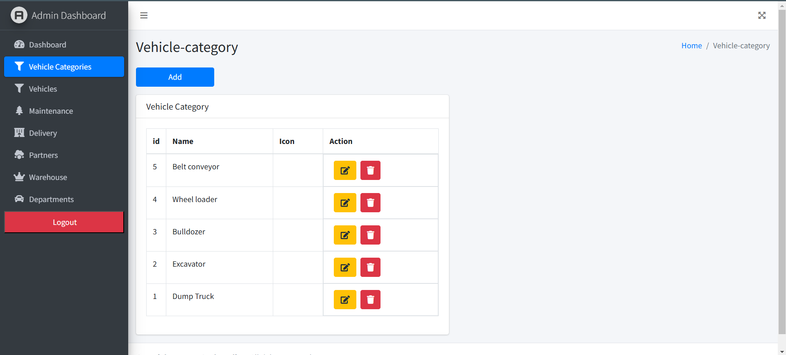

## Vehicle

### Add Vehicle

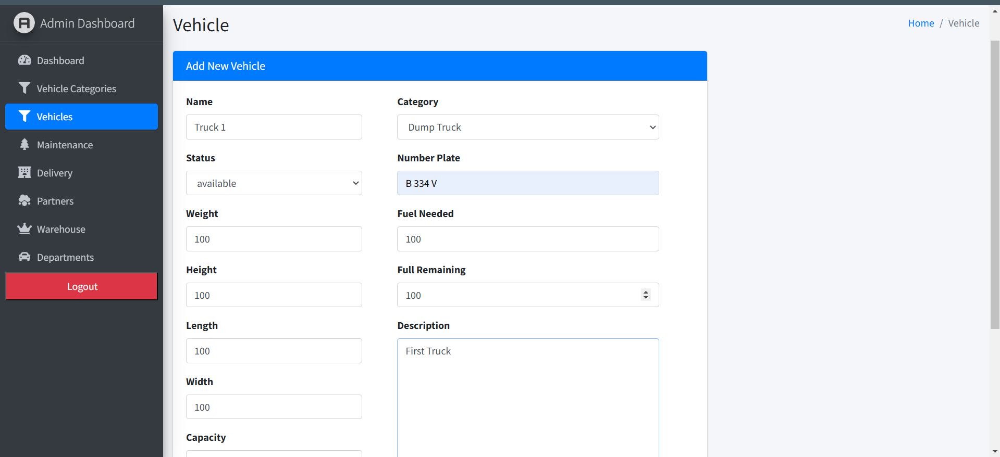
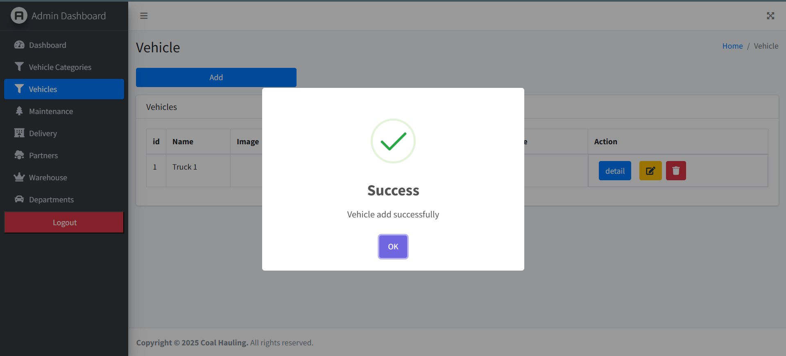

### List Vehicle

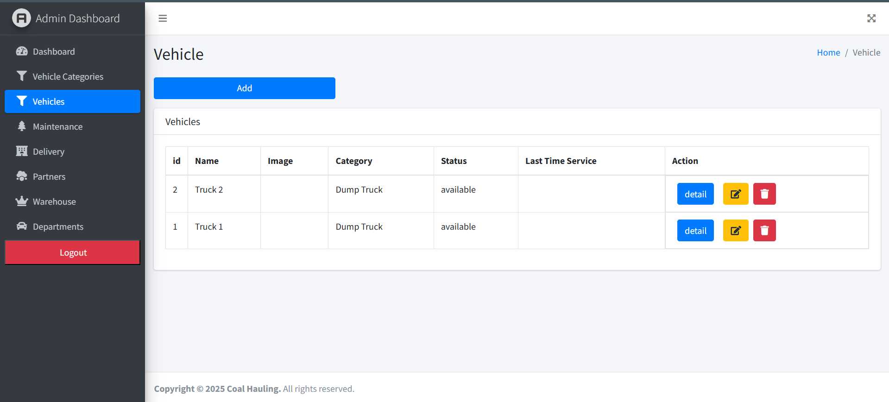

## Delivery

### Error Assign Vehicle

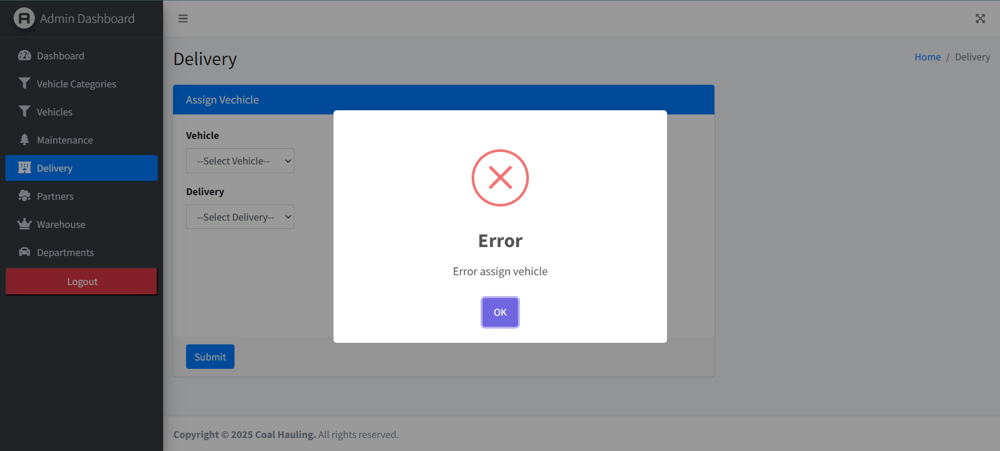

### Add New Delivery Data

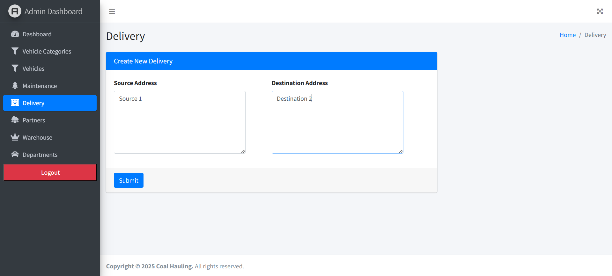

### Assign New Vehicle

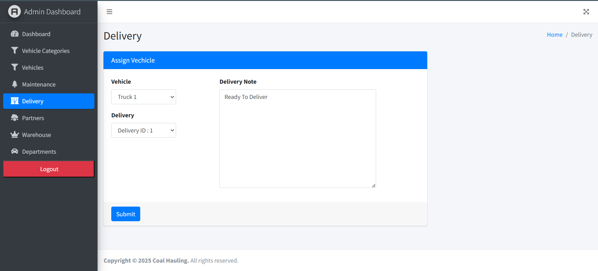

### Deliver All Assigned Vehicle

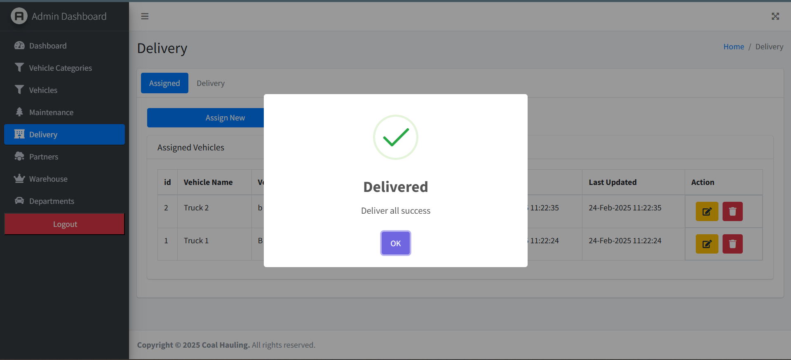

### Track Delivery Progres

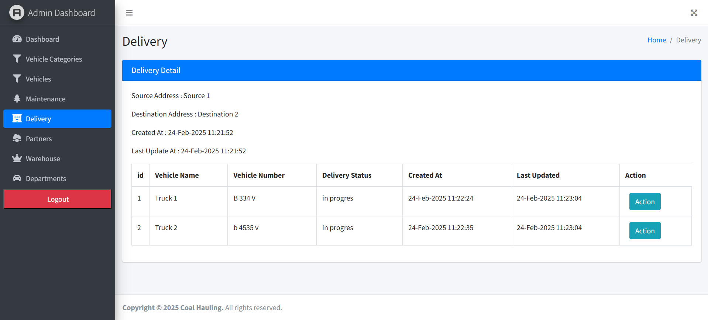

### Change Delivery Status

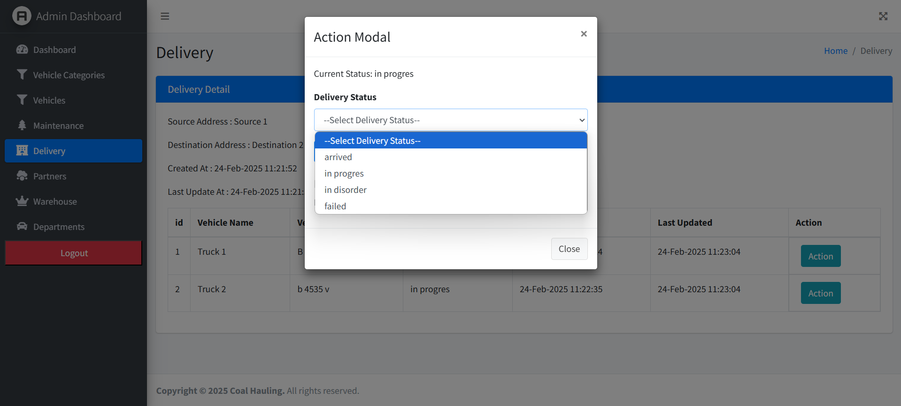

## Partner

### Add New Partner

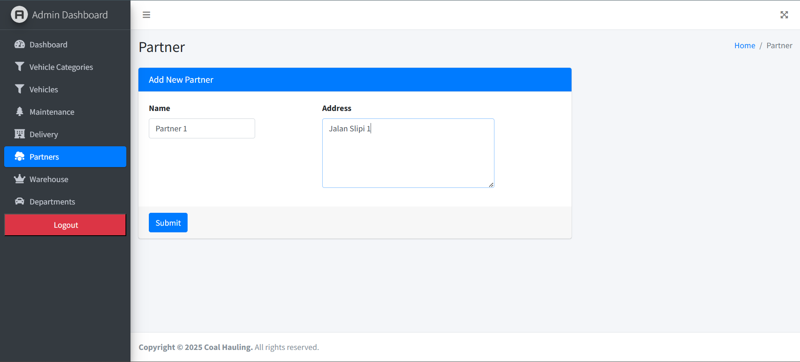

## Warehouse

### Add New Spare Part

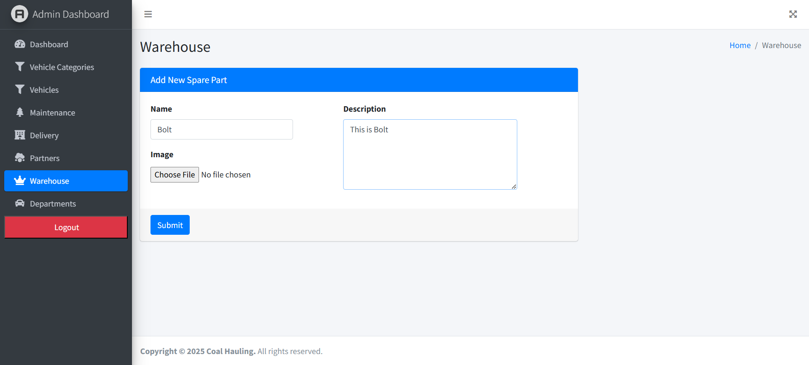

### Supply Spare Part

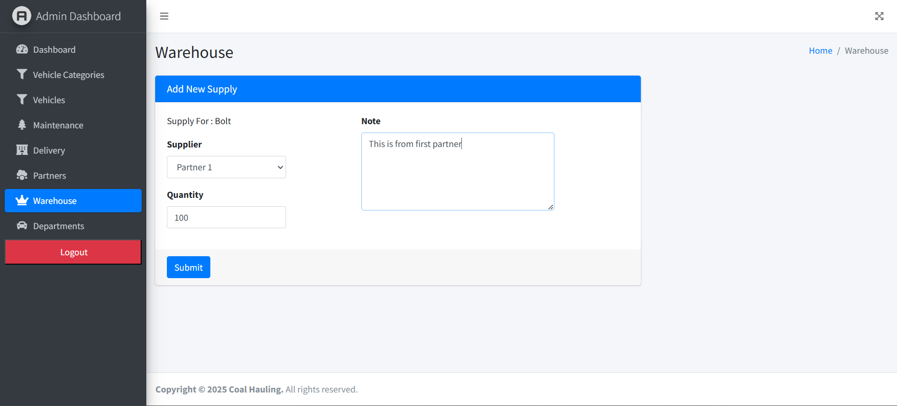
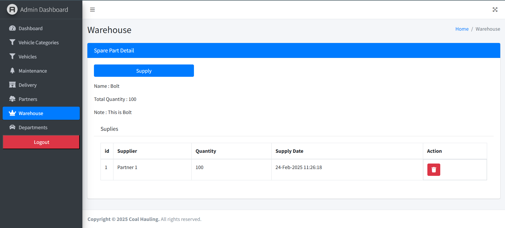
